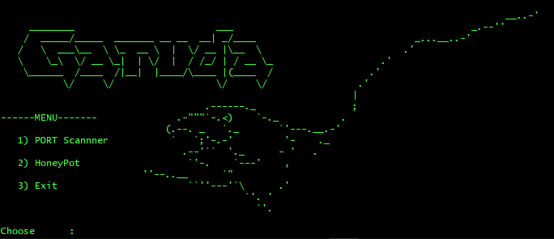

<!-- ALL-CONTRIBUTORS-BADGE:START - Do not remove or modify this section -->

<!-- ALL-CONTRIBUTORS-BADGE:END -->
# About Tool :

It is a combination of Network Port Scanner and Honeypot.
* Scanner is used to scan IP addresses, and discover hosts and services on a computer network by sending packets and analyzing the responses.
* Low-interaction honeypot simply captures connection attempts and alerts you an intrusion has been attempted to your system. 

## Available And Tested On:
* Windows
* Linux (coming soon)
 

## Featues :
* [+] Port Scanning !
* [+] Honeypot !
* [+] Updated maintainence !
* [+] Easy for Beginners !

## How to use :
* git clone https://github.com/Bauddhik-Geeks/Garuda.git
* cd garuda
* python3 garuda.py

## Screenshot :

  
## **WARNING :**
***This tool is only for educational purpose. If you use this tool for other purposes except education we will not be responsible in such cases.***

  

## Contributors ✨

Thanks goes to these wonderful people ([emoji key](https://allcontributors.org/docs/en/emoji-key)):

<!-- ALL-CONTRIBUTORS-LIST:START - Do not remove or modify this section -->
<!-- prettier-ignore-start -->
<!-- markdownlint-disable -->
<table>
  <tr>
    <td align="center"><a href="http://In process"> <b>Rajkumar Khistariya</b></a> <a href="https://github.com/Bauddhik-Geeks/Garuda/commits?author=Rajkumar-stackcoder" title="Code">💻</a></td>
    <td align="center"><a href="https://github.com/EFFLUX110"> <b>EFFLUX</b></a> <a href="https://github.com/Bauddhik-Geeks/Garuda/commits?author=EFFLUX110" title="Code">💻</a></td>
  </tr>
</table>

<!-- markdownlint-restore -->
<!-- prettier-ignore-end -->

<!-- ALL-CONTRIBUTORS-LIST:END -->

This project follows the [all-contributors](https://github.com/all-contributors/all-contributors) specification. Contributions of any kind welcome!